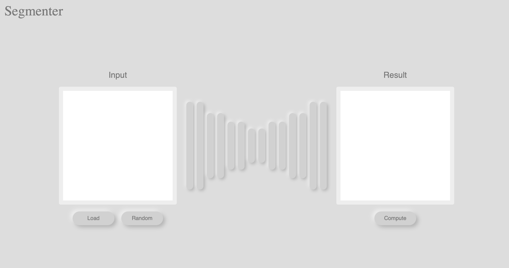

# Segmenter WebService

Веб сервис для сервинга модели Image Segmentation (DeepLabV3)

## HOWTO

### QUICKSTART:
`bash run.sh` - команда делает необходимые подготовительные действия и запускает контейнеры. После запуска сервис доступен по адресу `127.0.0.1:8080`. 

**Внимание** - на старте сервису нужно подгрузить дополнительные веса для моделей, поэтому первые 1-2 минуты Image segmentation сервис может быть недоступен; необходимо подождать, пока в логах контейнера `serve` не появится следующее log-сообщение:
```[DEBUG] W-9001-deeplabv3_resnet_101_1.0 org.pytorch.serve.wlm.WorkerThread - W-9001-deeplabv3_resnet_101_1.0 State change WORKER_STARTED -> WORKER_MODEL_LOADED``` 

Для запуска сервиса необходимо:
1. Загрузить веса модели.
   ```bash
   wget https://download.pytorch.org/models/deeplabv3_resnet101_coco-586e9e4e.pth -O serve/deeplabv3/deeplabv3_resnet101_coco-586e9e4e.pth
   ```
2. Построить и запустить docker-containers.
    ```bash
    docker-compose up --build
    ```


## Description

Сервис состоит из следующих модулей

- Frontend: 
  - Веб интерфейс, написанный на [Vue.js](https://vuejs.org)
  - В качестве сервера используется [Nginx](https://nginx.org)
- Backend:
  - Сервис для api запросов с frontend. Написан на [Flask](https://flask.palletsprojects.com/en/2.2.x/)
  - Хостинг происходит с помощью [uWSGI](https://uwsgi-docs.readthedocs.io/en/latest/)
- Serve:
  - Сервис сервинга модели. Используется [TorchServe](https://pytorch.org/serve/). Изолирован от Frontend. Общение происходит только с Backend сервисом.

## Frontend:
    
Веб-интерфейс выглядит следующим образом:


Имеется следующий функционал:
- Load - загрузить произвольную картинку. Результат появится в поле `Input`
- Random - взять произвольную картинку из сервиса. Результат появится в поле `Input`
- Compute - Отправить запрос на сервер. Полученный результат появится в поле `Result`

---

## Backend:

API-сервис. Имеет следующие endpoints:

- `GET /api/random_image` - Запрос на получение произвольной картинки из базы. Возможные результаты:
  - `200` - OK
  - `501` - Server Error. В базе нет изображений 
- `POST /api/run_model` - Запрос на генерацию маски по изображению. В теле необходимо передать параметр `image` - `base64` закодированное изображение. Возможные результаты
  - `200` - OK
  - `400` - Bad Request
  - `5xx` - Serving Error

---

## Serving

Сервис-сервинг для `torch` модели. Имеет следующие endpoint:

- `POST /predictions/deeplabv3_resnet_101` - запрос на инференс модели. Используется только внутри сервиса backend. Наружу не имеет доступа.

---
